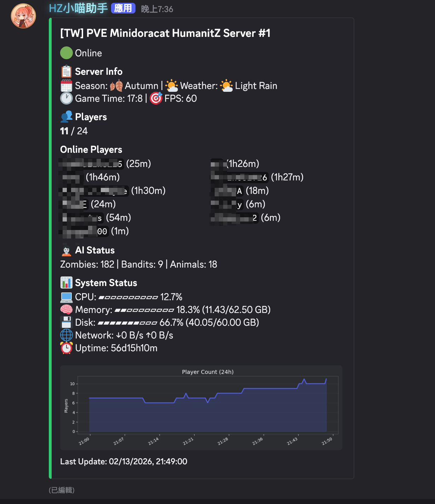

# HumanitZ Discord Bot

[](https://opensource.org/licenses/MIT)
[](https://www.python.org/downloads/)
[](https://github.com/Rapptz/discord.py)

> **[繁體中文版 README](README.zh-TW.md)**

A Discord bot for [HumanitZ](https://store.steampowered.com/app/1935610/HumanitZ/) dedicated game servers. Provides real-time server status monitoring, bidirectional chat bridge, and player tracking — all powered by RCON.

## Features

- **📊 Live Server Status Embed** — Auto-updating Discord message showing server name, player count, season/weather, AI stats (zombies, bandits, animals), death count (configurable time window), game time, FPS, and system resources (CPU/RAM/disk/network)
- **💬 Bidirectional Chat Bridge** — Relay messages between in-game chat and a Discord channel in real time, with echo prevention and @mention sanitization
- **📈 Player Count Chart** — 24-hour (configurable) history chart with Discord-themed dark styling
- **👥 Player Online Duration** — Shows how long each player has been connected, parsed from server logs
- **🗄️ SQLite Database** — Persistent storage for player count history, chat logs, and player session events with automatic data pruning
- **🌐 Internationalization** — English and Traditional Chinese (繁體中文) UI support
- **📝 Daily Rotated Logs** — Configurable log retention with daily rotation
- **🎮 Game Commands (Optional)** — In-game `!` commands powered by [uesave](https://github.com/trumank/uesave-rs) save file parsing. Players can query coordinates, survival stats, leaderboards, server state, and help. Supports English and Chinese aliases. Responses appear in both Discord and in-game chat. Toggleable via `ENABLE_GAME_COMMANDS`.

## Screenshots



## Architecture

```
src/humanitz_bot/
├── __main__.py          # Entry point, logging setup, signal handling
├── bot.py               # Discord bot initialization, cog loading
├── config.py            # Settings from .env with validation
├── rcon_client.py       # Source RCON protocol (optimized for HumanitZ)
├── save_extractor.py    # Subprocess: extract player data from uesave JSON
├── cogs/
│   ├── server_status.py # Status embed auto-update loop (30s default)
│   ├── chat_bridge.py   # Chat bridge polling + game command routing
│   └── game_commands.py # In-game ! commands (coords, stats, top, etc.)
├── services/
│   ├── database.py      # SQLite with WAL mode + thread safety
│   ├── rcon_service.py  # Async RCON wrapper with auto-reconnect
│   ├── chart_service.py # Matplotlib chart generation
│   ├── player_tracker.py# Online duration from PlayerConnectedLog.txt
│   ├── player_identity.py# Player name ↔ SteamID mapping
│   ├── save_service.py  # Save file parsing orchestration + query API
│   └── system_stats.py  # CPU, memory, disk, network via psutil
└── utils/
    ├── chat_parser.py   # fetchchat markup parser + dedup differ
    ├── formatters.py    # Progress bars, duration, emoji maps
    └── i18n.py          # en + zh-TW translations
```

## Prerequisites

- **Python 3.12+**
- **[uv](https://docs.astral.sh/uv/)** — Fast Python package manager
- A **HumanitZ dedicated server** with RCON enabled
- A **Discord Bot Token** ([create one here](https://discord.com/developers/applications))

> **Note:** Windows is supported but has not been tested in production. If you encounter any issues, please [open an issue](https://github.com/Minidoracat/humanitz-bot/issues).

## Quick Start

### 1. Clone the repository

```bash
git clone https://github.com/Minidoracat/humanitz-bot.git
cd humanitz-bot
```

### 2. Install dependencies

```bash
uv sync
```

### 3. Configure

```bash
cp .env.example .env
```

Edit `.env` and fill in your values:

| Variable | Required | Description |
|----------|----------|-------------|
| `DISCORD_TOKEN` | ✅ | Bot token from Discord Developer Portal |
| `STATUS_CHANNEL_ID` | ✅ | Channel for the status embed |
| `CHAT_CHANNEL_ID` | ✅ | Channel for the chat bridge |
| `RCON_PASSWORD` | ✅ | RCON password (from `GameServerSettings.ini`) |
| `RCON_HOST` | | RCON address (default: `127.0.0.1`) |
| `RCON_PORT` | | RCON port (default: `8888`) |
| `STATUS_MESSAGE_ID` | | Pin the status embed to a specific message (leave blank to auto-create) |
| `MAX_PLAYERS` | | Max player count from `GameServerSettings.ini` (default: `50`) |
| `SHOW_SYSTEM_STATS` | | Show host system stats in embed (default: `true`; set `false` for remote setups) |
| `SHOW_CONNECT_INFO` | | Show server IP:Port in the status embed (default: `false`) |
| `SERVER_CONNECT_INFO` | | Public server address for direct connect (format: `IP:Port`) |
| `SHOW_DEATH_COUNT` | | Show player death count in embed (default: `true`) |
| `DEATH_COUNT_HOURS` | | Time window in hours for death count (default: `24`) |
| `LOCALE` | | `en` or `zh-TW` (default: `en`) |
| `PLAYER_LOG_PATH` | | Path to `PlayerConnectedLog.txt` |
| `ENABLE_GAME_COMMANDS` | | Enable in-game `!` commands with save file parsing (default: `true`) |
| `SAVE_FILE_PATH` | | Path to `Save_DedicatedSaveMP.sav` (auto-detected if not set) |
| `SAVE_JSON_PATH` | | Path for uesave JSON output (default: `/tmp/main_save.json`) |
| `SAVE_PARSE_INTERVAL` | | Seconds between scheduled save parses (default: `300`) |
| `SAVE_PARSE_COOLDOWN` | | Minimum seconds between on-demand parses (default: `60`) |

See [`.env.example`](.env.example) for all options with detailed descriptions. A [Traditional Chinese version](.env.example.zh-TW) is also available.

### 4. Run

```bash
uv run python -m humanitz_bot
```

### Run with Docker

```bash
cp .env.example .env   # edit .env first
docker compose up -d
```

> **Note:** System stats (CPU, memory, disk) will reflect the container's resources, not the host machine.

### HumanitZ Server Configuration

Make sure RCON is enabled in your `GameServerSettings.ini`:

```ini
RCONEnabled=true
RConPort=8888
RCONPass=your_password_here
```

### Discord Bot Permissions

The bot requires these permissions (intents):
- **Message Content** — Read messages for chat bridge
- **Send Messages** — Send chat and status messages
- **Embed Links** — Display status embed
- **Attach Files** — Upload player count chart

Enable **Message Content Intent** in Discord Developer Portal → Bot → Privileged Gateway Intents.

## Game Commands (Optional)

The bot supports in-game `!` commands that query parsed save file data. This feature requires [uesave](https://github.com/trumank/uesave-rs) to be installed.

### Install uesave

```bash
# Using cargo (Rust package manager)
cargo install uesave

# Or download pre-built binary from GitHub releases
# https://github.com/trumank/uesave-rs/releases
```

Verify installation:

```bash
uesave --version
```

### Available Commands

| Command | Alias | Description |
|---------|-------|-------------|
| `!coords` | `!位置` | Show your current coordinates |
| `!stats` | `!狀態` | Show your survival stats (health, hunger, thirst, kills, etc.) |
| `!top` | `!排行` | Survival days leaderboard (top 10) |
| `!kills` | `!擊殺` | Kill statistics leaderboard (top 10 by zombie kills) |
| `!server` | `!伺服器` | Server state (days passed, season day) |
| `!help` | `!幫助` | List available commands |

Commands can be used both in-game and in the Discord chat bridge channel. The response language is determined by which alias you use — English alias (`!coords`) returns English, Chinese alias (`!位置`) returns Chinese.

### How It Works

1. Save file (`.sav`) is parsed periodically using `uesave to-json` (subprocess)
2. A separate extractor subprocess loads the JSON and outputs a small summary (~166KB from ~280MB)
3. Extracted data is stored in SQLite for fast queries
4. The bot process never loads the large JSON — memory-efficient by design

### Disabling Game Commands

Set `ENABLE_GAME_COMMANDS=false` in `.env` to disable this feature entirely. The bot will function normally without uesave installed when disabled.


## RCON Protocol Notes

HumanitZ uses a modified Source RCON protocol with some quirks:

- Response `request_id` is always `0` (non-standard)
- Does **not** respond to empty commands (end-marker technique unusable)
- Auth flow: server sends `RESPONSE_VALUE` (type=0) then `AUTH_RESPONSE` (type=2)
- ~3 second response delay per command

The bot handles all of these automatically.

## Data Storage

| Path | Content | Tracked by Git |
|------|---------|----------------|
| `data/humanitz_bot.db` | SQLite database (player counts, chat logs, sessions) | ❌ |
| `data/status_state.json` | Persisted status message ID for restart resilience | ❌ |
| `tmp/player_chart.png` | Latest player count chart (overwritten each cycle) | ❌ |
| `logs/bot.log` | Application logs (daily rotation) | ❌ |

All runtime data is excluded from git via `.gitignore`.

## License

[MIT](LICENSE) © [Minidoracat](https://github.com/Minidoracat)