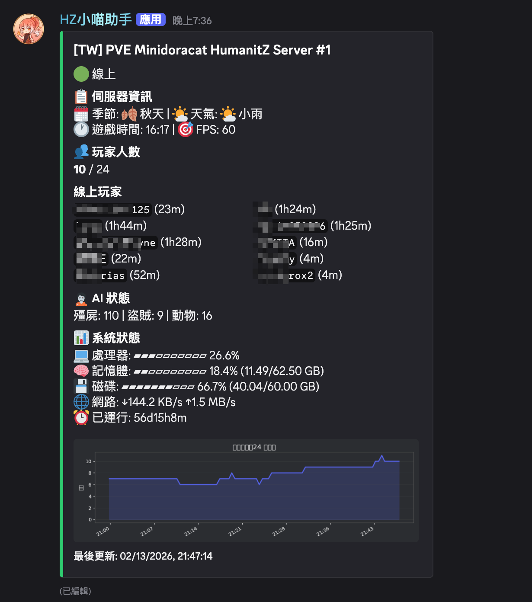

# HumanitZ Discord Bot

[](https://opensource.org/licenses/MIT)
[](https://www.python.org/downloads/)
[](https://github.com/Rapptz/discord.py)

> **[English README](README.md)**

專為 [HumanitZ](https://store.steampowered.com/app/1935610/HumanitZ/) 專用伺服器設計的 Discord Bot。透過 RCON 提供即時伺服器狀態監控、雙向聊天橋接、以及玩家追蹤功能。

## 功能特色

- **📊 即時伺服器狀態 Embed** — 自動更新的 Discord 訊息，顯示伺服器名稱、玩家人數、季節/天氣、AI 狀態（殭屍、盜賊、動物）、死亡統計（可自訂時間範圍）、遊戲時間、FPS、系統資源（CPU/記憶體/磁碟/網路）
- **💬 雙向聊天橋接** — 即時轉發遊戲內聊天與 Discord 頻道訊息，內建回聲防止與 @mention 消毒
- **📈 玩家人數圖表** — 24 小時（可設定）歷史圖表，Discord 深色主題風格
- **👥 玩家在線時長** — 從伺服器日誌解析每位玩家的連線時長
- **🗄️ SQLite 資料庫** — 持久化儲存玩家人數歷史、聊天記錄、上下線事件，含自動資料清理
- **🌐 多語系支援** — 英文與繁體中文介面
- **📝 日誌輪替** — 按日分檔，可設定保留天數
- **🎮 遊戲指令（可選）** — 透過 [uesave](https://github.com/trumank/uesave-rs) 解析存檔，支援遊戲內 `!` 指令查詢。玩家可查詢座標、生存狀態、排行榜、伺服器狀態及說明。支援英文與中文別名。回應同時顯示在 Discord 和遊戲內。可透過 `ENABLE_GAME_COMMANDS` 開關此功能。

## 截圖預覽



## 專案架構

```
src/humanitz_bot/
├── __main__.py          # 程式進入點、logging 設定、signal handling
├── bot.py               # Discord bot 初始化、Cog 載入
├── config.py            # 從 .env 載入設定並驗證
├── rcon_client.py       # Source RCON 協議（針對 HumanitZ 最佳化）
├── save_extractor.py    # 子程序：從 uesave JSON 提取玩家資料
├── cogs/
│   ├── server_status.py # 狀態 Embed 自動更新（預設 30 秒）
│   ├── chat_bridge.py   # 聊天橋接輪詢 + 遊戲指令路由
│   └── game_commands.py # 遊戲內 ! 指令（座標、狀態、排行等）
├── services/
│   ├── database.py      # SQLite WAL 模式 + 執行緒安全
│   ├── rcon_service.py  # 非同步 RCON 封裝 + 自動重連
│   ├── chart_service.py # Matplotlib 圖表生成
│   ├── player_tracker.py# 從 PlayerConnectedLog.txt 計算在線時長
│   ├── player_identity.py# 玩家名稱 ↔ SteamID 對應
│   ├── save_service.py  # 存檔解析排程 + 查詢 API
│   └── system_stats.py  # CPU、記憶體、磁碟、網路（psutil）
└── utils/
    ├── chat_parser.py   # fetchchat 標記解析器 + 去重比對
    ├── formatters.py    # 進度條、時長格式、emoji 對照表
    └── i18n.py          # en + zh-TW 翻譯字串
```

## 環境需求

- **Python 3.12+**
- **[uv](https://docs.astral.sh/uv/)** — 快速 Python 套件管理器
- 已啟用 RCON 的 **HumanitZ 專用伺服器**
- **Discord Bot Token**（[在此建立](https://discord.com/developers/applications)）

> **注意：** Windows 環境已支援但尚未經過實際測試。如遇到問題，請[回報 Issue](https://github.com/Minidoracat/humanitz-bot/issues)。

## 快速開始

### 1. 取得專案

```bash
git clone https://github.com/Minidoracat/humanitz-bot.git
cd humanitz-bot
```

### 2. 安裝依賴

```bash
uv sync
```

### 3. 設定

```bash
cp .env.example .env
```

編輯 `.env` 並填入你的設定值：

| 變數 | 必填 | 說明 |
|------|------|------|
| `DISCORD_TOKEN` | ✅ | Discord Developer Portal 取得的 Bot Token |
| `STATUS_CHANNEL_ID` | ✅ | 伺服器狀態 Embed 顯示頻道 |
| `CHAT_CHANNEL_ID` | ✅ | 聊天橋接頻道 |
| `RCON_PASSWORD` | ✅ | RCON 密碼（對應 `GameServerSettings.ini`） |
| `RCON_HOST` | | RCON 位址（預設：`127.0.0.1`） |
| `RCON_PORT` | | RCON 連接埠（預設：`8888`） |
| `STATUS_MESSAGE_ID` | | 固定狀態 Embed 到指定訊息（留空則自動建立） |
| `MAX_PLAYERS` | | 伺服器最大玩家人數，對應 `GameServerSettings.ini`（預設：`50`） |
| `SHOW_SYSTEM_STATS` | | 顯示主機系統資源（預設：`true`；遠端架設建議設為 `false`） |
| `SHOW_CONNECT_INFO` | | 是否在狀態 Embed 中顯示伺服器連線資訊（預設：`false`） |
| `SERVER_CONNECT_INFO` | | 伺服器公開連線位址（玩家直連用，格式：`IP:Port`） |
| `SHOW_DEATH_COUNT` | | 是否顯示玩家死亡次數（預設：`true`） |
| `DEATH_COUNT_HOURS` | | 死亡統計的時間範圍，單位小時（預設：`24`） |
| `LOCALE` | | `en` 或 `zh-TW`（預設：`en`） |
| `PLAYER_LOG_PATH` | | `PlayerConnectedLog.txt` 檔案路徑 |
| `ENABLE_GAME_COMMANDS` | | 啟用遊戲內 `!` 指令與存檔解析功能（預設：`true`） |
| `SAVE_FILE_PATH` | | `Save_DedicatedSaveMP.sav` 路徑（未設定則自動偵測） |
| `SAVE_JSON_PATH` | | uesave JSON 輸出路徑（預設：`/tmp/main_save.json`） |
| `SAVE_PARSE_INTERVAL` | | 排程存檔解析間隔秒數（預設：`300`） |
| `SAVE_PARSE_COOLDOWN` | | 指令觸發解析的最小冷卻秒數（預設：`60`） |

完整選項請參考 [`.env.example`](.env.example)，亦提供[繁體中文版](.env.example.zh-TW)。

### 4. 啟動

```bash
uv run python -m humanitz_bot
```

### 使用 Docker 啟動

```bash
cp .env.example .env   # 先編輯 .env
docker compose up -d
```

> **注意：** 系統資源（CPU、記憶體、磁碟）顯示的是容器內的數值，而非宿主機。

### HumanitZ 伺服器設定

確保 `GameServerSettings.ini` 已啟用 RCON：

```ini
RCONEnabled=true
RConPort=8888
RCONPass=你的密碼
```

### Discord Bot 權限

Bot 需要以下權限（intents）：
- **Message Content** — 讀取訊息內容（聊天橋接用）
- **Send Messages** — 發送聊天和狀態訊息
- **Embed Links** — 顯示狀態 Embed
- **Attach Files** — 上傳玩家人數圖表

在 Discord Developer Portal → Bot → Privileged Gateway Intents 中啟用 **Message Content Intent**。

## 遊戲指令（可選）

Bot 支援遊戲內 `!` 指令，透過解析存檔資料查詢玩家狀態。此功能需要安裝 [uesave](https://github.com/trumank/uesave-rs)。

### 安裝 uesave

```bash
# 使用 cargo（Rust 套件管理器）
cargo install uesave

# 或從 GitHub Releases 下載預編譯二進位檔
# https://github.com/trumank/uesave-rs/releases
```

確認安裝：

```bash
uesave --version
```

### 可用指令

| 指令 | 別名 | 說明 |
|------|------|------|
| `!coords` | `!位置` | 顯示你的目前座標 |
| `!stats` | `!狀態` | 顯示生存狀態（血量、飢餓、口渴、擊殺等） |
| `!top` | `!排行` | 存活天數排行榜（前 10 名） |
| `!kills` | `!擊殺` | 擊殺統計排行榜（前 10 名，依殲屍擊殺數排序） |
| `!server` | `!伺服器` | 伺服器狀態（經過天數、季節日數） |
| `!help` | `!幫助` | 列出可用指令 |

指令可在遊戲內和 Discord 聊天橋接頻道中使用。回應語言取決於使用的指令別名 — 英文指令（`!coords`）回應英文，中文指令（`!位置`）回應中文。

### 運作原理

1. 定期透過 `uesave to-json` 子程序解析存檔（`.sav`）
2. 獨立的提取子程序載入 JSON 並輸出精簡摘要（~166KB，原始 ~280MB）
3. 提取的資料儲存在 SQLite 中供快速查詢
4. Bot 主程序不會載入完整 JSON — 記憶體使用最佳化

### 停用遊戲指令

在 `.env` 中設定 `ENABLE_GAME_COMMANDS=false` 即可完全停用此功能。停用時不需要安裝 uesave，Bot 其他功能正常運作。


## RCON 協議筆記

HumanitZ 使用修改版的 Source RCON 協議，有以下特性：

- 回應的 `request_id` 固定為 `0`（非標準行為）
- **不**回應空指令（end-marker 技巧無法使用）
- 認證流程：伺服器先回 `RESPONSE_VALUE` (type=0) 再回 `AUTH_RESPONSE` (type=2)
- 每個指令約有 3 秒回應延遲

Bot 已自動處理所有這些特性。

## 資料儲存

| 路徑 | 內容 | Git 追蹤 |
|------|------|----------|
| `data/humanitz_bot.db` | SQLite 資料庫（玩家人數、聊天記錄、上下線） | ❌ |
| `data/status_state.json` | 持久化的狀態訊息 ID（重啟後復用） | ❌ |
| `tmp/player_chart.png` | 最新玩家人數圖表（每次更新覆寫） | ❌ |
| `logs/bot.log` | 應用程式日誌（按日輪替） | ❌ |

所有運行時資料已透過 `.gitignore` 排除。

## 授權

[MIT](LICENSE) © [Minidoracat](https://github.com/Minidoracat)
